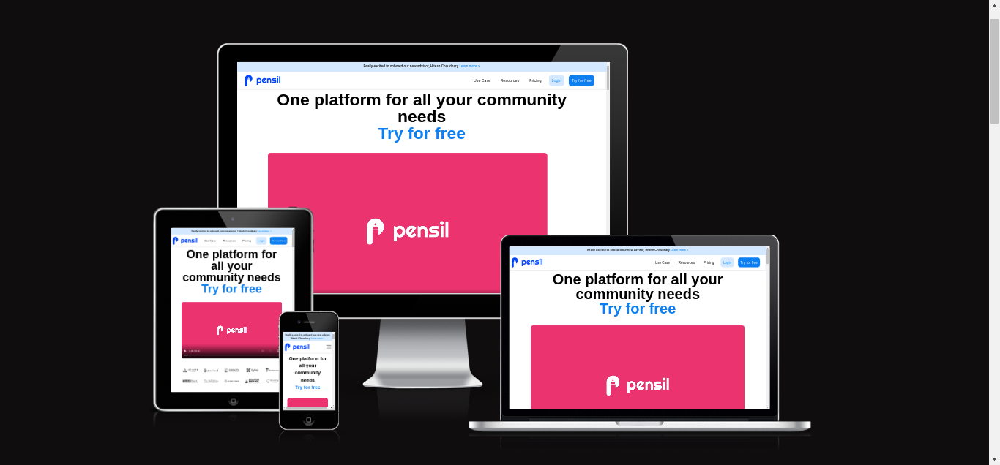
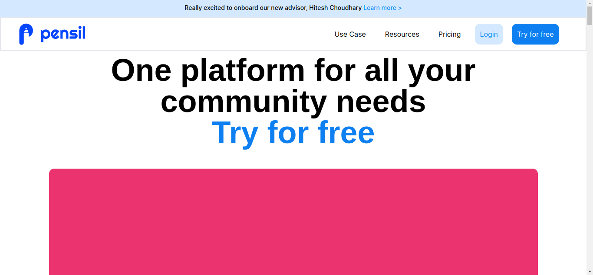
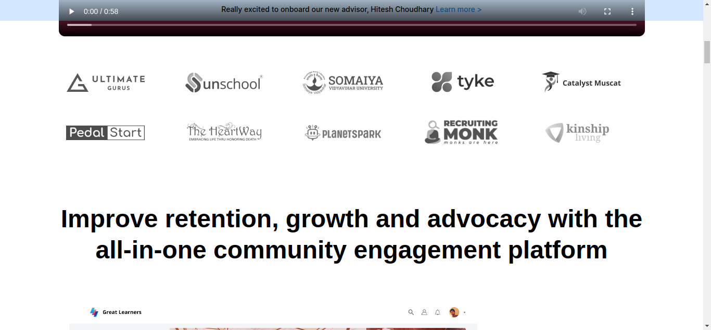
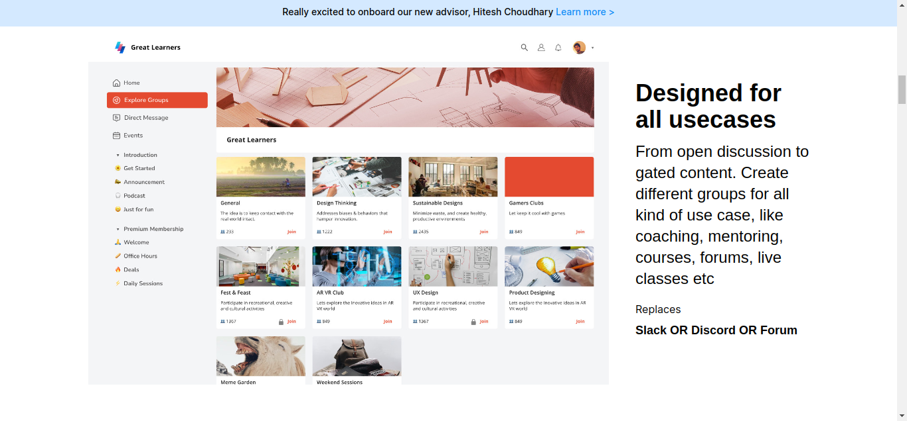
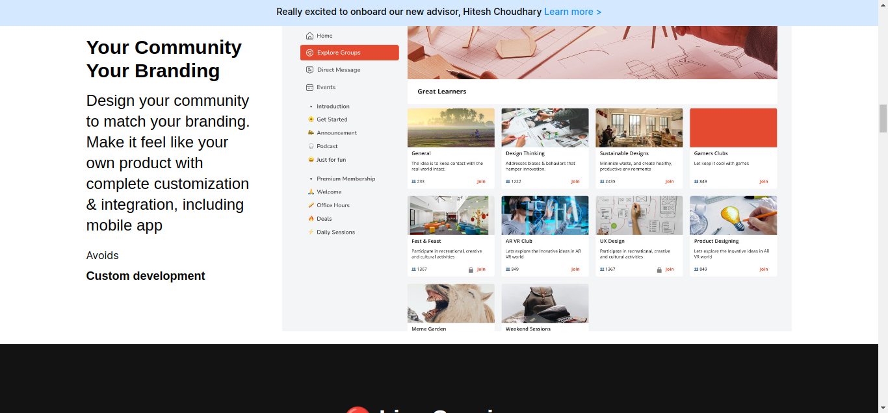
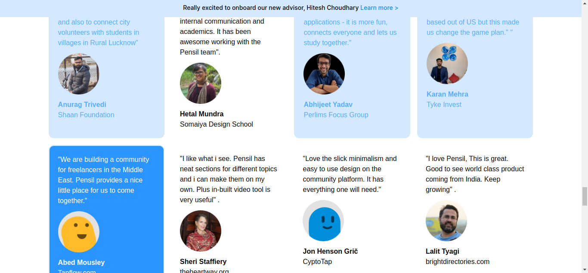
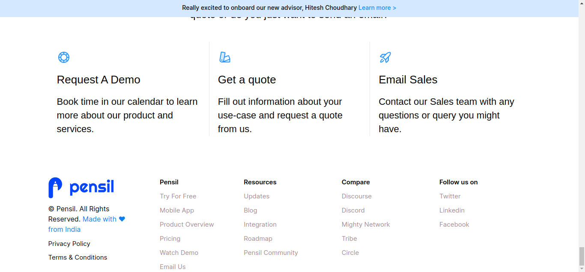

# I am Abhishek Singh

## I am larning Full Stack Javascript Development 

## Project on Tailwind

## Project Name : [Clone of Pensil.in]

_I have created the clone of pensil.in using only tailwind css._

## What I did in this Project ?
_I have created as same as the pensil.in website i only haven't used animation and navbar dropdown i am learning these all things_

# Challenging Part 
_Using Animation in the website and matrix and dropdown_ 
_I did not used  dropdown  and animation in clone._

# Technology used:
1. ```HTML5```
1. ```Tailwind CSS```

# Deployed Link
[Netlify Link](https://pensil-clone-web.netlify.app/)











# Time Taken To Complete This project

_14hours_